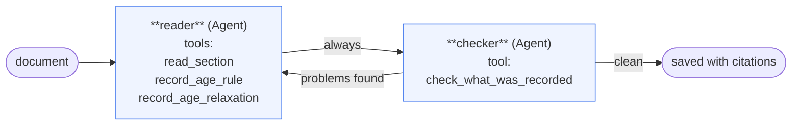
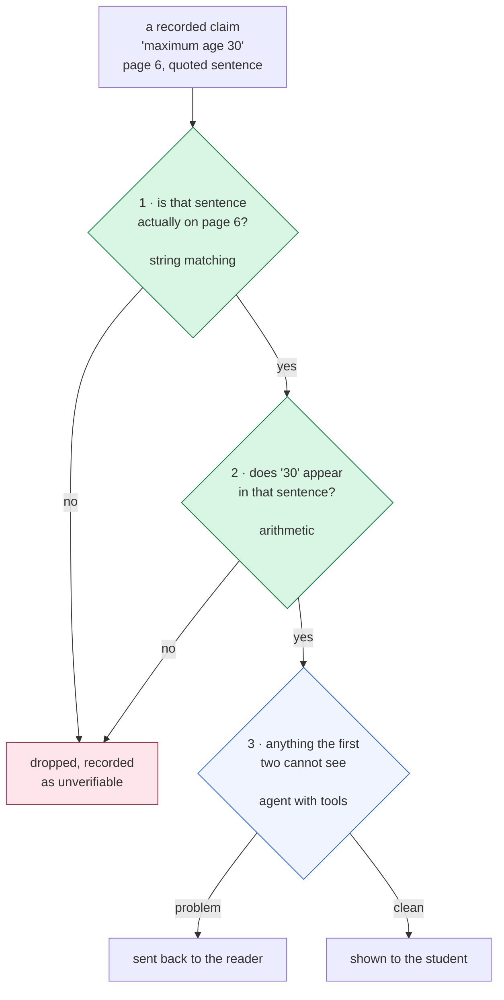
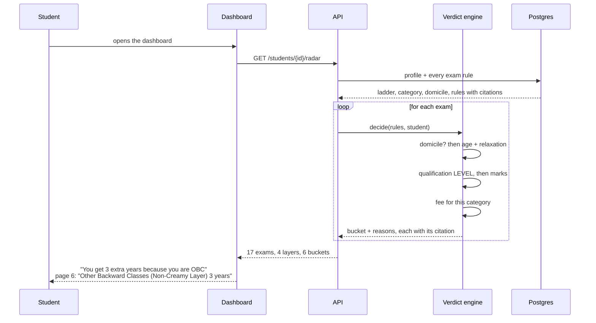
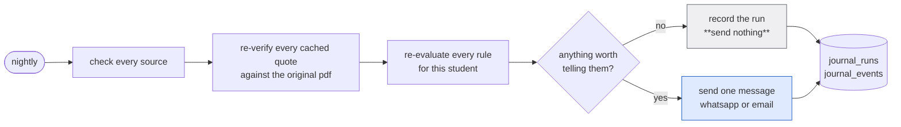
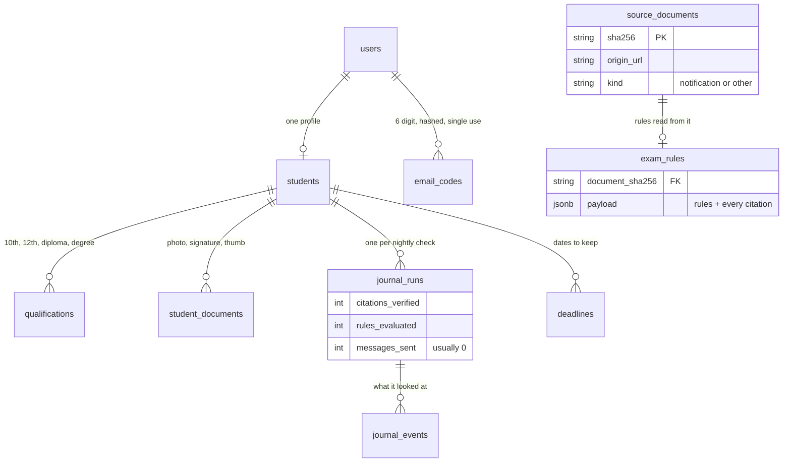
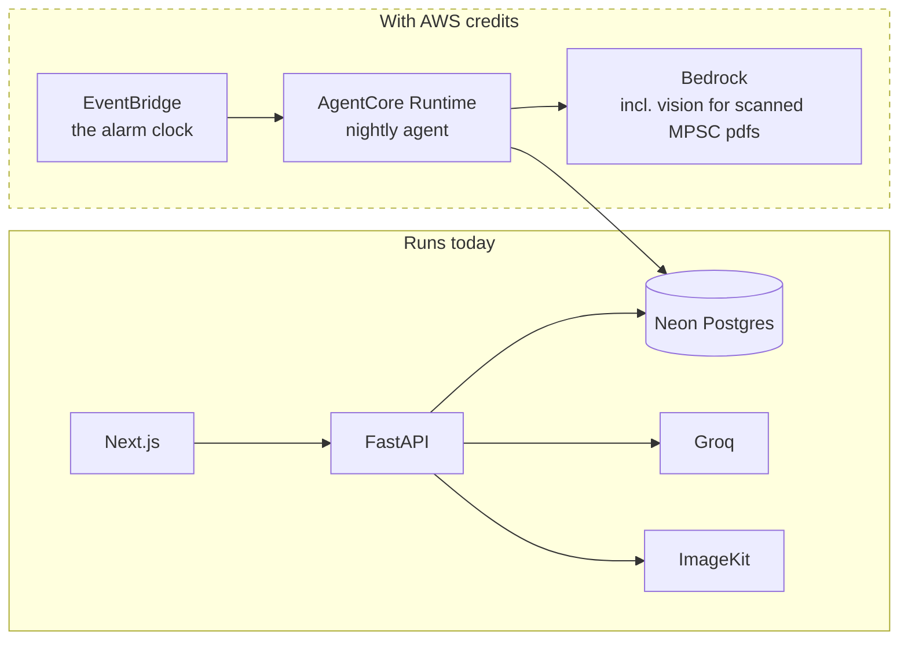

# Sarathi architecture

## The whole system

```mermaid
flowchart TB
    subgraph sources["Official sources only"]
        ssc["SSC<br/>public JSON API"]
        upsc["UPSC<br/>HTML + PDFs"]
        ibps["IBPS<br/>HTML + PDFs"]
        mpsc["MPSC<br/>real browser, JS rendered"]
        cal["SSC exam calendar<br/>real browser"]
    end

    subgraph ingest["Ingest"]
        cache["PDF cache<br/>sha256 + origin url<br/>committed to the repo"]
        classify["Classifier agent<br/>notification, or tender?"]
    end

    subgraph reading["Reading the rules"]
        graph["Strands cyclic Graph<br/>reader ⇄ checker"]
        verify["Verification<br/>3 layers, 2 need no AI"]
        prune["Prune what cannot be proven"]
    end

    subgraph store["Postgres"]
        rules[("exam_rules<br/>JSONB + citations")]
        student[("students<br/>+ qualification ladder")]
        journal[("journal_runs<br/>journal_events")]
    end

    subgraph decide["Deciding, in plain Python"]
        engine["Verdict engine<br/>age · relaxation · level<br/>marks · fee · domicile"]
        radar["Exam Radar<br/>4 layers, 6 buckets"]
    end

    subgraph out["What the student sees"]
        web["Next.js dashboard"]
        docs["Document maker<br/>exact pixels and bytes"]
        wrong["When I was wrong"]
        msg["WhatsApp / email"]
    end

    sources --> cache --> classify --> graph --> verify --> prune --> rules
    cal --> rules
    rules --> engine
    student --> engine
    engine --> radar --> web
    rules --> docs --> web
    rules --> wrong --> web
    engine --> journal --> web
    journal --> msg
```

## The Strands graph that reads a notification

The reader records what it finds. The checker calls a tool that compares every recorded number against the page it claims to come from. The edge back to the reader **only fires when problems were reported**, so a bad reading is corrected instead of saved.



Built with `GraphBuilder`, `reset_on_revisit(True)`, an `EdgeCondition` on the loop-back, and `set_max_node_executions` so it can never spin forever.

## Verification, and why two layers use no AI



**Why this shape.** During development we planted errors in real extracted data: maximum age 30 changed to 45, OBC relaxation 3 changed to 9. The AI verifier **missed both**. The plain numeric check **caught both instantly**.

The most dangerous error in this product is a real quote paired with a wrong number, because the quote looks legitimate and a model reading it can be persuaded. Arithmetic cannot be persuaded. So the two checks that matter run in code, and the model handles only what code cannot.

## A verdict, end to end



## The nightly run, and the silence



A real pair of runs from the journal:

```
15 July      64 checks run  →  0 messages   "nothing needed your attention"
29 August    64 checks run  →  1 message    "closes in 13 days and you can apply"
```

Same work. Different answer. The Agent Journal exists so that silence is visible instead of looking like nothing happened.

## Choosing a model, and staying inside its limits

```mermaid
flowchart TB
    call["an agent needs a model"]
    pacer["token budget pacer<br/>Strands hook on BeforeModelCallEvent"]
    router{"MODEL_PROVIDER"}

    groq["LiteLLMModel → Groq<br/>free tier, 8000 tokens per minute"]
    bedrock["BedrockModel<br/>Nova for bulk, Claude for judgement"]

    call --> pacer --> router
    router -->|groq| groq
    router -->|bedrock| bedrock

    style pacer fill:#fdefdb,stroke:#8a5a12
```

Groq's free tier allows 8,000 tokens a minute, and a tool-calling agent resends its whole conversation every turn. The pacer tracks a rolling minute and waits rather than failing. One environment variable switches to Bedrock; no other code changes.

## Data model



## Deployment



Two things are genuinely waiting on AWS credits, and both are real rather than decorative:

- **AgentCore Runtime + EventBridge** give the agent an alarm clock. Today the nightly script exists and works; what is missing is the cloud runtime that calls it.
- **Bedrock vision** would read MPSC's scanned notifications. They are photographs of paper, so no amount of text extraction will ever read them.
